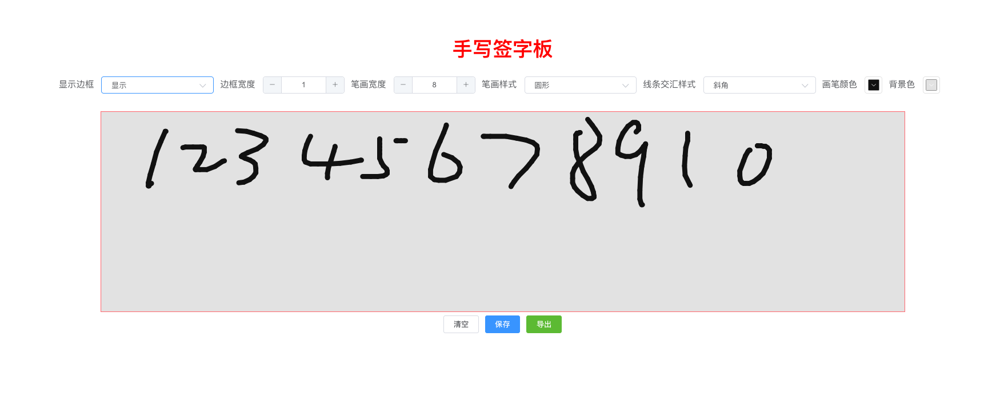

# canvas-writing-board

[在线demo](https://codepen.io/boboooooo/pen/wvzpmGJ)


基于`canvas`的手写签字版,支持外接wacom等触控笔输入设备。

使用Pressure.js库获取笔画压感,采用浏览器原生[pointEventer](https://developer.mozilla.org/zh-cn/docs/web/api/pointerevent)事件

目前最佳实践: `win10 + chrome + wacom` 可以成功获取压感

**注意: win7下似乎pointEventer无法获取到输入设备压感,有成功的小伙伴麻烦issue留个言**

## 开始使用

```javascript
npm install canvas-writing-board
```

```javascript
import CanvasWritingBoard from 'canvas-writing-board'
import 'canvas-writing-board/lib/canvas-writing-board.css';

<CanvasWritingBoard @save="(base64)=>{console.log(base64)}" :title="手写签字版">
    <button slot="button">下方自定义按钮1</button>
</CanvasWritingBoard>
```

## 效果展示



## props

title
## event
save
## slot
button